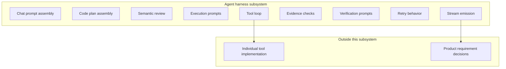
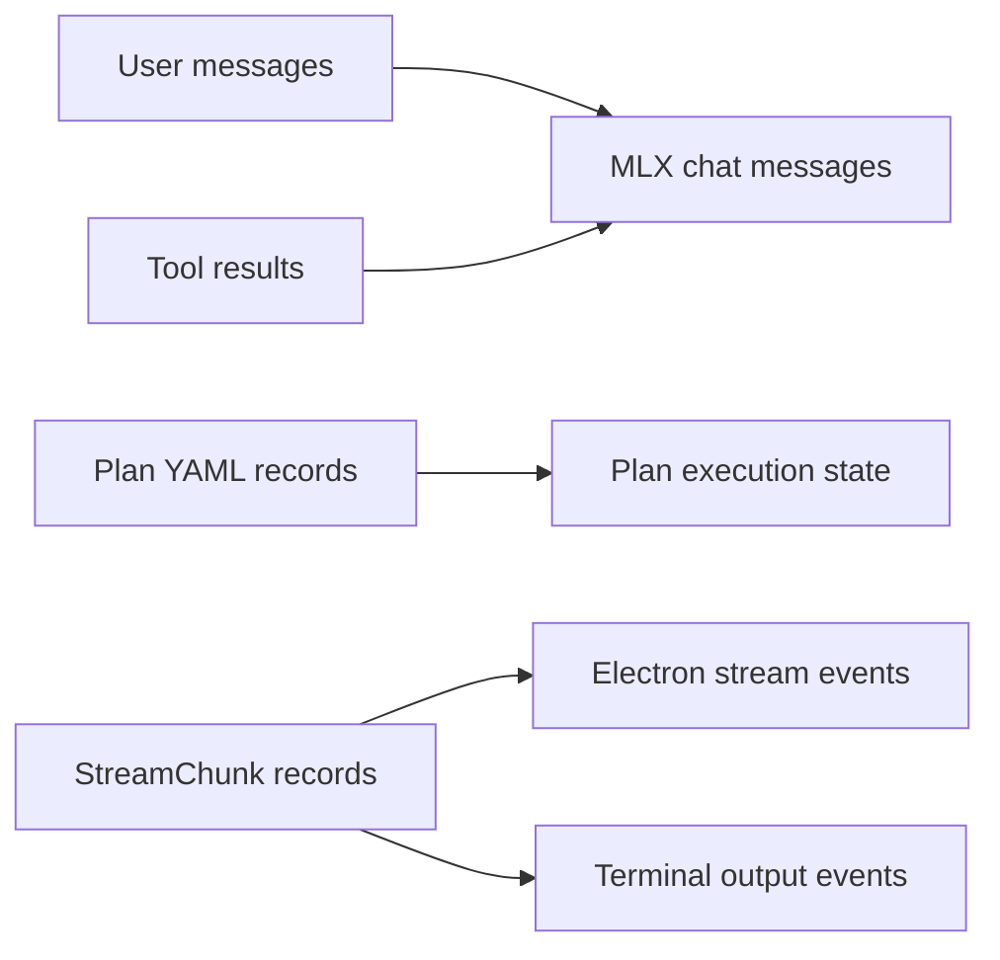
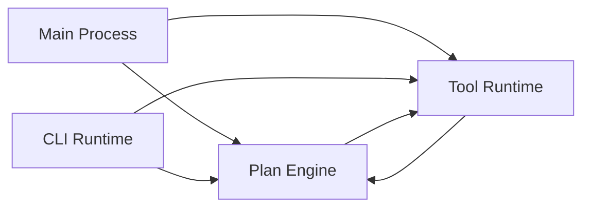
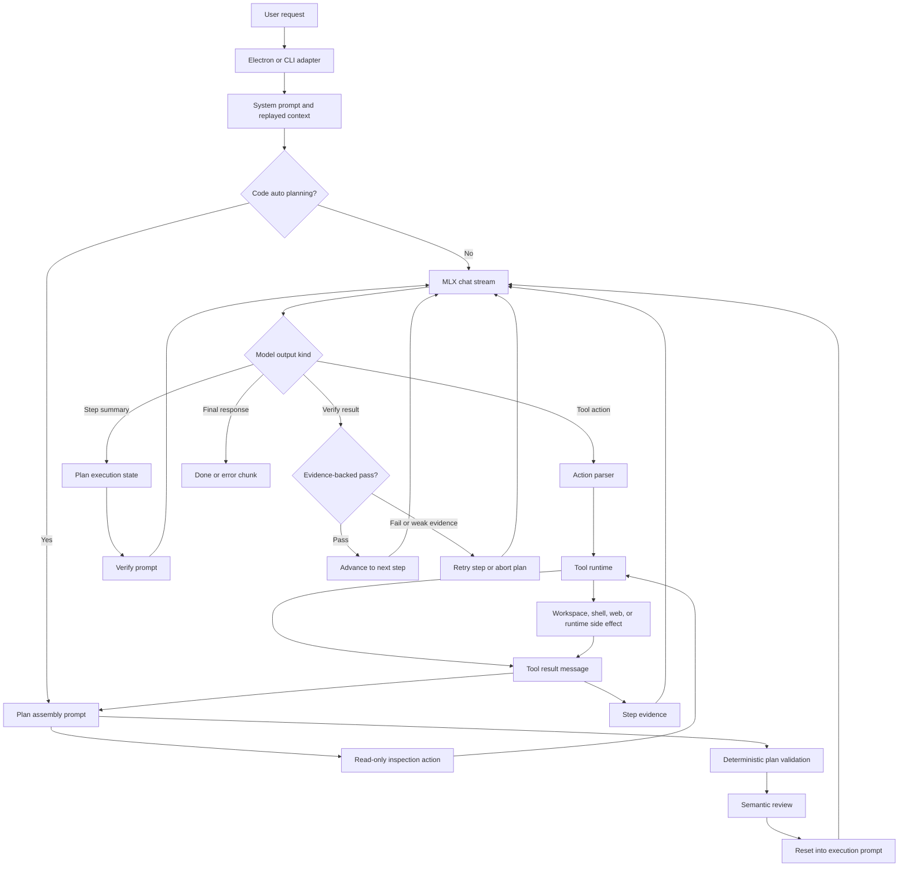
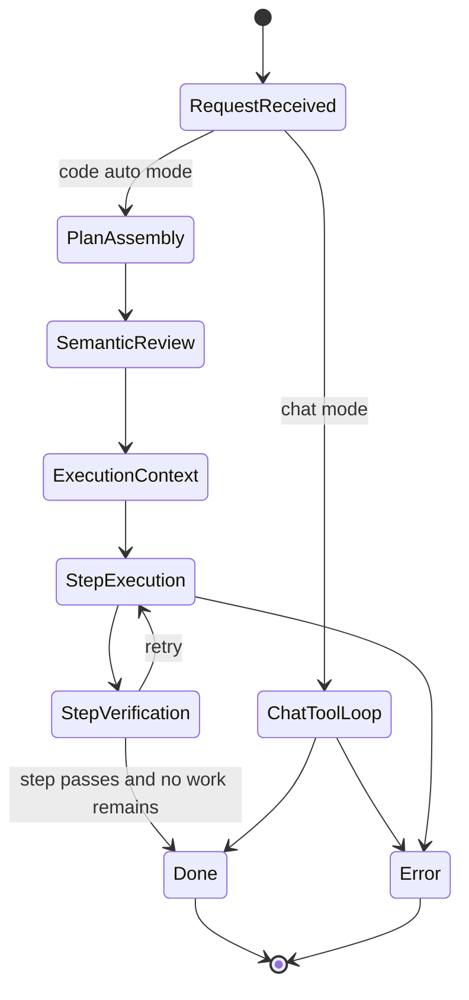
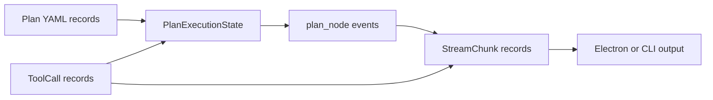
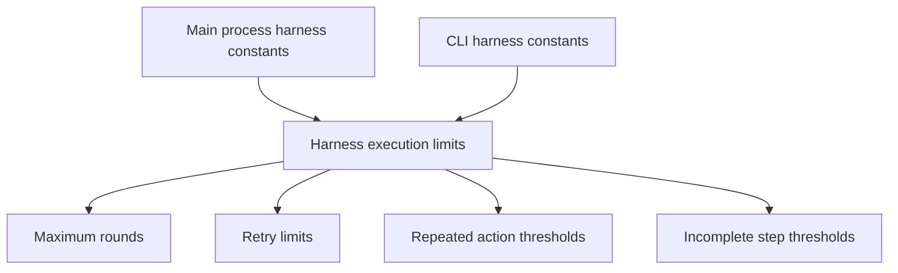
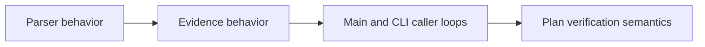
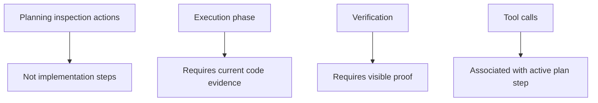
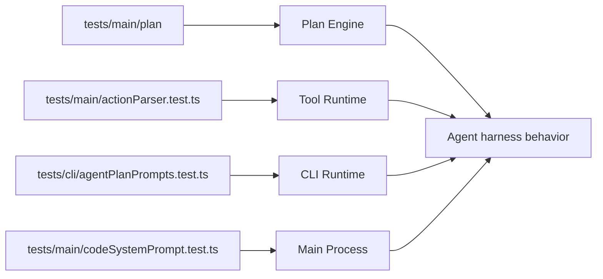

# Agent Harness High-Level Design

## Current Understanding

The agent harness transforms user prompts into local model requests, structured planning, semantic review, tool execution, evidence gathering, verification, and streamed UI or terminal events.

## Authoritative Sources

- [Main Process](../modules/main-process.md)
- [CLI Runtime](../modules/cli-runtime.md)
- [Tool Runtime](../modules/tool-runtime.md)
- [Plan Engine](../modules/plan-engine.md)
- [General purpose plan harness](../../../design/general-purpose-plan-harness.md)
- [README app workflow](../../../README.md)

## Related Code

- [src/main/index.ts](../../../src/main/index.ts)
- [src/cli/agent.ts](../../../src/cli/agent.ts)
- [src/main/tools/index.ts](../../../src/main/tools/index.ts)
- [src/main/plan](../../../src/main/plan)
- [Gemma prompt files](../../../Gemma.code.md)

## Related Tests

- [tests/main/actionParser.test.ts](../../../tests/main/actionParser.test.ts)
- [tests/main/plan](../../../tests/main/plan)
- [tests/cli/agentPlanPrompts.test.ts](../../../tests/cli/agentPlanPrompts.test.ts)
- [tests/main/codeSystemPrompt.test.ts](../../../tests/main/codeSystemPrompt.test.ts)

## Related Backlog Items

- Not yet identified.

## Related Wiki Pages

- [Architecture](../technical/architecture.md)
- [Code Task Execution](../functional/code-task-execution.md)
- [Tool Runtime](../modules/tool-runtime.md)
- [Plan Engine](../modules/plan-engine.md)

## Open Questions

No open wiki questions are recorded for this topic.

## Maintenance Notes

- Recheck when prompt modes, plan review, evidence forcing, verification, or tool protocol changes.

## Parent Architecture

[Architecture](../technical/architecture.md) governs this subsystem.

## Scope

Includes chat prompt assembly, code plan assembly, semantic review, execution prompts, tool loop, evidence checks, verification prompts, retries, and stream emission.

This diagram is included because the scope defines included harness capabilities and separates them from tool implementation and product requirement ownership.

## Current Data Anchors

- User messages and tool results become MLX chat messages.
- Plan steps are YAML records with name, prompt, and verify fields.
- StreamChunk records carry model tokens, tool calls, plan nodes, reviews, harness messages, done, and errors.

This diagram is included because the subsystem has several data anchors that become derived prompts, execution state, and user-visible stream records.

## Constituent Components

- [Main Process](../modules/main-process.md) adapts harness output to Electron.
- [CLI Runtime](../modules/cli-runtime.md) adapts harness output to terminal workflows.
- [Tool Runtime](../modules/tool-runtime.md) provides action protocol and tool dispatch.
- [Plan Engine](../modules/plan-engine.md) provides plan, evidence, and verify behavior.

This diagram is included because the subsystem defines multiple components whose responsibilities are associated through shared harness behavior.

## Interaction Model

The harness builds a system prompt, streams model output, parses actions, runs tools, records tool evidence, prompts for summaries and verification, and advances or retries based on evidence-backed results.

This diagram is included because the interaction model has ordered handoffs, branches, retries, and verification states.

Keep the Mermaid block as the editable diagram source. A rendered SVG can be linked as an additional artifact for surfaces that cannot render Mermaid, but the SVG should not be the only maintained source.

## Lifecycle

Chat mode runs a bounded tool loop. Code auto mode assembles and reviews a plan, resets into execution context, executes each step, verifies, and emits terminal done or error chunks.

This diagram is included because the subsystem has different chat and code-auto states, plus retry and terminal states.

## Data Shapes And Contracts

PlanExecutionState owns plan node events. ToolCall records capture action name, args, result, errors, running state, and optional parent step id.

This diagram is included because the subsystem shares plan, tool, evidence, and stream contracts across components.

## Configuration

Maximum rounds, retry limits, repeated action thresholds, and incomplete step thresholds are constants in main and CLI harness files.

This diagram is included because the subsystem has parallel main-process and CLI harness limits that shape the same runtime behavior.

## Implementation Order

Parser and evidence behavior should be updated before caller loops depend on new plan or verification semantics.

This diagram is included because the implementation order has a dependency between parser behavior, evidence behavior, caller loops, and verification semantics.

## Invariants

- Planning inspection actions are not implementation steps.
- Execution should not rely on planning scratch work as current code evidence.
- Verification must fail without visible proof.
- Tool calls are associated with active plan steps when possible.

This diagram is included because the subsystem invariants constrain different phases, evidence sources, and component associations.

## Non-Goals

- The harness does not own individual tool implementation behavior.
- The harness does not decide product requirements beyond the user's prompt and project instructions.

## Definition Of Good

The same request semantics are available through Electron and CLI, with visible plan, tool, evidence, and verification behavior.

## Verification

Use [tests/main/plan](../../../tests/main/plan), [tests/main/actionParser.test.ts](../../../tests/main/actionParser.test.ts), [tests/cli/agentPlanPrompts.test.ts](../../../tests/cli/agentPlanPrompts.test.ts), and [tests/main/codeSystemPrompt.test.ts](../../../tests/main/codeSystemPrompt.test.ts).

This diagram is included because verification comes from several test groups that cover different harness responsibilities.

