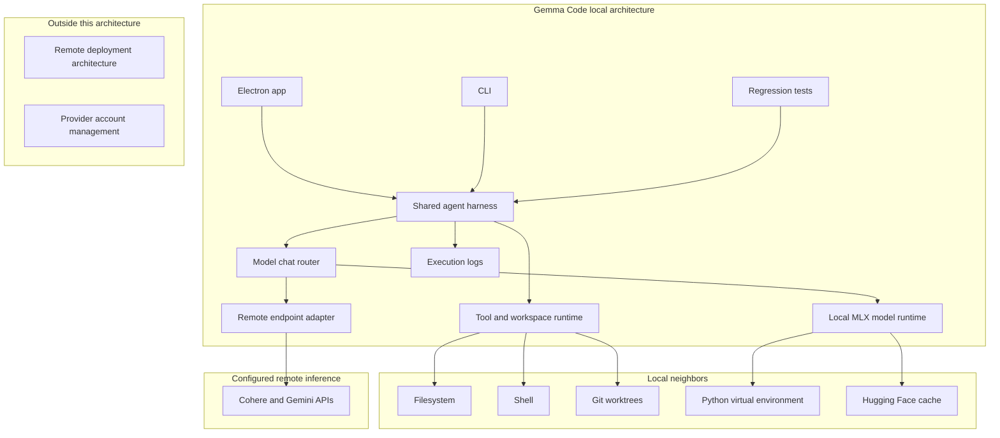
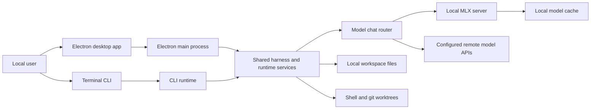
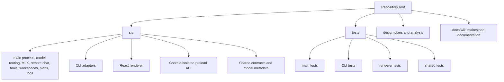
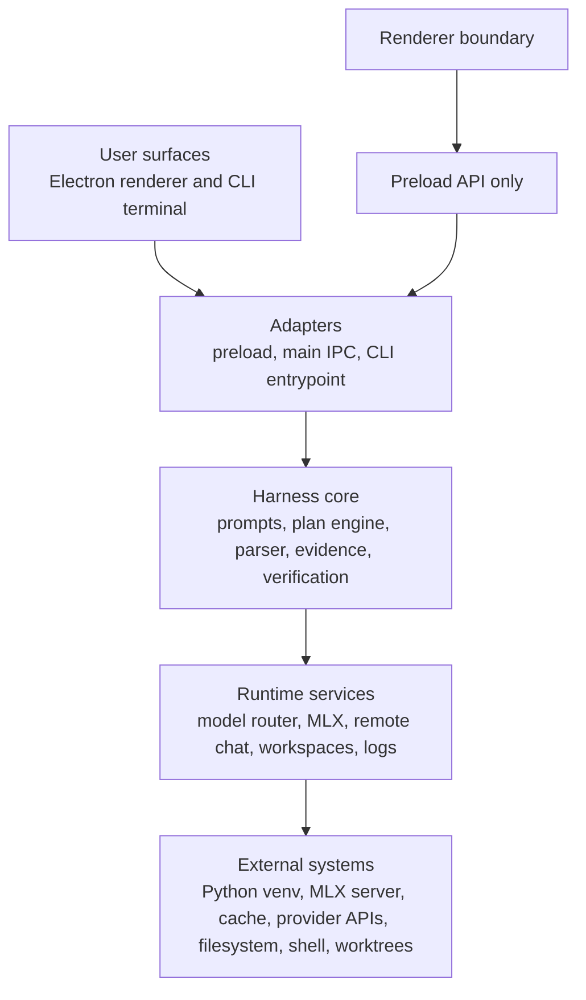
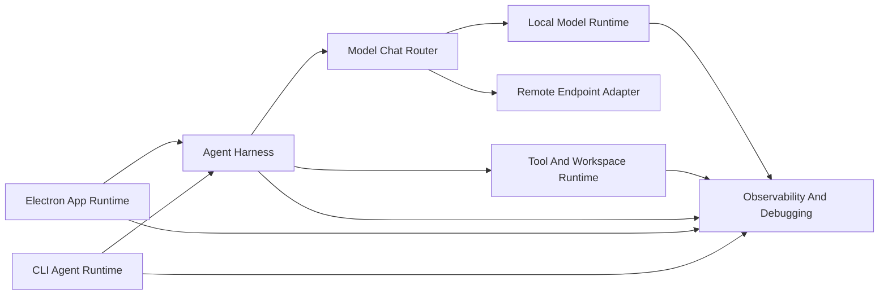
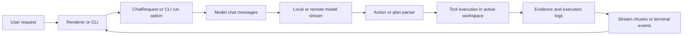
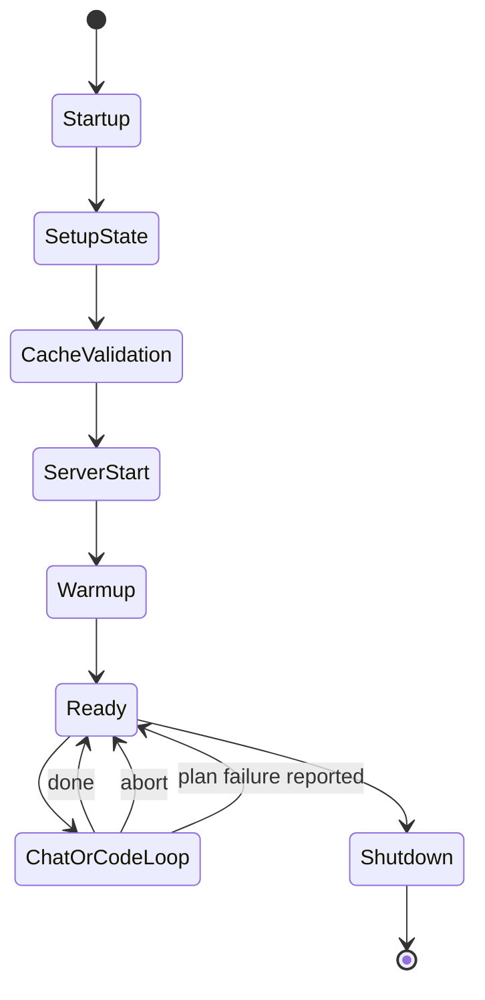
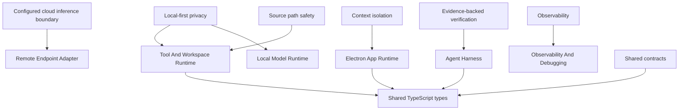
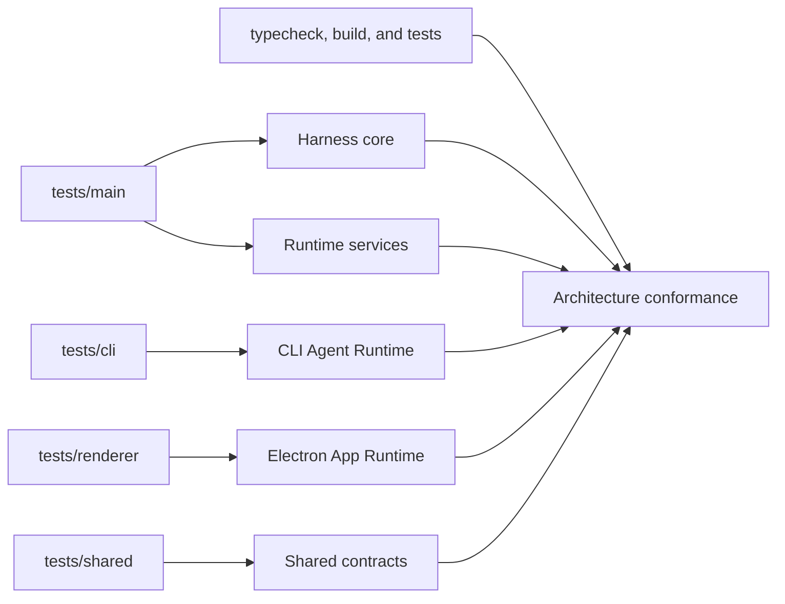

# Gemma Code Architecture

## Current Understanding

Gemma Code is a local-first coding agent for macOS on Apple Silicon. It has an Electron desktop app and a TypeScript CLI that share configurable model routing, a local MLX runtime, optional remote endpoint adapters, a tool protocol, a workspace runtime, and a structured planning harness.

## Authoritative Sources

- [README](../../../README.md)
- [Agent instructions](../../../AGENTS.md)
- [Module Designs](../modules/index.md)
- [Subsystem Designs](../subsystems/index.md)
- [Source tree](../../../src)
- [Tests](../../../tests)
- [CLI runtime implementation plan](../../../design/cli-runtime-implementation-plan.md)
- [General purpose plan harness](../../../design/general-purpose-plan-harness.md)
- [MLX transparency implementation plan](../../../design/mlx-transparency-implementation-plan.md)

## Related Code

- [src/main](../../../src/main)
- [src/cli](../../../src/cli)
- [src/renderer](../../../src/renderer)
- [src/preload](../../../src/preload)
- [src/shared](../../../src/shared)
- [electron.vite.config.ts](../../../electron.vite.config.ts)
- [package.json](../../../package.json)

## Related Tests

- [tests/main](../../../tests/main)
- [tests/cli](../../../tests/cli)
- [tests/renderer](../../../tests/renderer)
- [tests/shared](../../../tests/shared)

## Related Backlog Items

- Not yet identified.

## Related Wiki Pages

- [Subsystem Designs](../subsystems/index.md)
- [Module Designs](../modules/index.md)
- [Functional Workflows](../functional/index.md)
- [Code Map](../code/index.md)
- [Open Decisions](../open-decisions.md)

## Open Questions

No open wiki questions are recorded for this topic.

## Maintenance Notes

- Recheck this page when runtime surfaces, dependency direction, model setup, plan harness behavior, or packaging changes.

## Purpose

The architecture defines how Gemma Code keeps local model execution and workspace tools first-class while allowing explicitly configured remote model endpoints for experiments through desktop and terminal surfaces.

## Scope

Included: local model runtime, optional configured cloud inference adapters, Electron app, CLI, shared agent harness, tools, workspaces, execution logs, and tests. Not included: remote deployment architecture or provider account management.

## Scope Boundary Diagram

This diagram is included because the scope defines included architecture items, local neighbors, and explicit exclusions as related boundary sets.

## System Context

Users run Gemma Code locally. The Electron app provides setup, model selection, chat/code workflows, workspace preview, and logs. The CLI provides setup/status/chat/code/plan flows in the terminal. Both surfaces route chat through the configured model router, which calls either the local MLX server or a configured remote endpoint. Tool execution and workspace file access remain local.

## System Context Diagram

This diagram is included because the context defines multiple actors, surfaces, local systems, and runtime neighbors that interact from outside to inside.

## Technology Stack

- TypeScript for application, CLI, runtime, tests, and shared contracts.
- Electron, Vite, and React for the desktop app.
- Node APIs for filesystem, child processes, HTTP preview, and CLI execution.
- MLX LM and MLX VLM Python packages for local model serving.
- Fetch-based remote endpoint adapters for configured cloud model experiments.
- Vitest for regression coverage.
- YAML parsing for plan documents and semantic review responses.

## File Organization

- [src/main](../../../src/main) owns Electron main process, model configuration, model chat routing, MLX, remote chat, tools, workspaces, plan engine, logs, and background tasks.
- [src/cli](../../../src/cli) owns terminal adapters.
- [src/renderer](../../../src/renderer) owns React UI.
- [src/preload](../../../src/preload) owns context-isolated IPC API.
- [src/shared](../../../src/shared) owns cross-process types and model metadata contracts.
- [tests](../../../tests) mirrors main, CLI, renderer, and shared behavior.
- [design](../../../design) contains implementation plans and analysis notes.
- [docs/wiki](..) contains the maintained documentation surface.

## Ownership Tree Diagram

This diagram is included because file organization is an aggregation and ownership structure across source, tests, design, and wiki areas.

## Architectural Layers

1. User surfaces: Electron renderer and CLI terminal.
2. Adapters: preload IPC bridge, Electron main IPC handlers, CLI entrypoint and agent adapter.
3. Harness core: prompts, plan engine, tool action parser, evidence, verification, chat history.
4. Runtime services: model chat router, MLX runtime, remote chat adapter, workspace runtime, execution logs, background tasks.
5. External systems: Python venv, MLX server, Hugging Face cache, configured model provider APIs, filesystem, shell, git worktrees.

Renderer code may depend on shared types and preload API, but not Node runtime APIs. CLI and Electron adapters may depend on shared runtime modules. Shared runtime modules should avoid depending on BrowserWindow.

## Layered Dependency Diagram

This diagram is included because the architecture defines ordered layers and dependency boundaries.

## Key Components

- [Local Model Runtime](../subsystems/local-model-runtime.md) owns MLX installation, cache validation, server lifecycle, warmup, and streaming.
- [Shared Types And Model Registry](../modules/shared-types-and-model-registry.md) owns configured model metadata, endpoint metadata, and model routing contracts.
- [Agent Harness](../subsystems/agent-harness.md) owns prompt, plan, tool, evidence, and verification flow.
- [Tool And Workspace Runtime](../subsystems/tool-and-workspace-runtime.md) owns tool execution and safe local file/workspace access.
- [Electron App Runtime](../subsystems/electron-app-runtime.md) owns desktop UI and IPC integration.
- [CLI Agent Runtime](../subsystems/cli-agent-runtime.md) owns terminal workflows and worktree isolation.
- [Observability And Debugging](../subsystems/observability-and-debugging.md) owns logs, runtime status, and background process visibility.

## Component Association Diagram

This diagram is included because the key components are associated through shared harness, runtime, and observability responsibilities.

## Data Flow

A user request starts in the renderer or CLI, becomes a ChatRequest or CLI run option, is converted into model chat messages, streams through the configured model route, is parsed for actions or plan artifacts, runs tools against the active workspace, records evidence and logs, and emits stream chunks or terminal output back to the user surface.

## Request Data Flow Diagram

This diagram is included because requests, messages, tool actions, evidence, logs, and user-visible output move through several components.

## Lifecycle Flow

App startup sets runtime paths, creates the Electron window, starts workspace services, and initializes setup state. Local setup locates or installs MLX, validates model cache, starts the model server, warms inference, and reports ready. Remote setup validates configured endpoint credentials and reports ready without starting MLX. Chat/code requests run bounded tool loops and stop on done, error, abort, or plan failure. Shutdown stops the local server, workspace server, and background tasks.

## Lifecycle Diagram

This diagram is included because startup, setup, ready state, request handling, failure reporting, and shutdown are ordered runtime states.

## Cross-Cutting Concerns

- Local-first privacy: local model inference and file operations run locally by default.
- Configured cloud inference: selecting a remote model sends prompt and tool context to the configured provider, so credentials and model choice are explicit boundaries.
- Evidence-backed verification: code execution steps require visible tool evidence before verify passes.
- Source path safety: workspace helpers block path escapes.
- Context isolation: renderer communicates through preload only.
- Observability: execution logs, setup statuses, runtime activities, and MLX logs provide local debug evidence.
- Shared contracts: stream, setup, model, workspace, and log types live in shared TypeScript.

## Concern Ownership Map

This diagram is included because cross-cutting concerns are owned or enforced by different components and shared contracts.

## Design Principles

- Keep Electron and CLI as adapters over shared runtime behavior.
- Prefer explicit planning and verification for code tasks.
- Keep model setup state actionable and visible.
- Keep tool access narrow, evidence-producing, and workspace-bound.
- Keep documentation source-backed and linked to code and tests.

## Invariants

- Code and tests outrank wiki summaries.
- Ready model state requires successful local warmup inference.
- Ready remote model state requires configured endpoint credentials.
- Renderer code does not receive raw Electron IPC access.
- Tool actions are parsed from explicit XML action blocks.
- Verification should not rely on hidden state or intended behavior.

## Risks And Trade-Offs

- A local model can be slower or less capable than cloud models, so the harness compensates with strict prompts, tools, and verification.
- Remote model experiments can improve capability but may send prompts, repository snippets, and tool outputs to the configured provider.
- MLX and model cache behavior depend on upstream Python packages and Hugging Face cache layout.
- Sharing runtime modules between Electron and CLI reduces duplication but requires adapter boundaries to stay clean.
- The current CLI default model differs from the shared app default; see [Open Decisions](../open-decisions.md).

## Verification

Architecture conformance is verified by [tests/main](../../../tests/main), [tests/cli](../../../tests/cli), [tests/renderer](../../../tests/renderer), [tests/shared](../../../tests/shared), plus package scripts for typecheck, build, and tests when source code changes.

## Verification Coverage Map

This diagram is included because architecture conformance is proven by several test roots and package checks that cover different layers and components.

